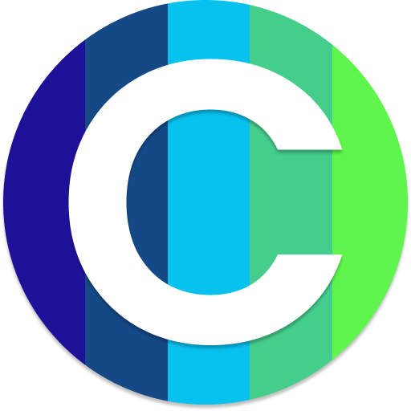

### Hi I'm Alejandro :man_technologist:

### You can contact me via:

[][linkedin]
[][instagram]

 

### Languages and tools used in this project:

 

# Colorly

Colorly is an app that generate a colorscheme for you to use on your designs. You can export the colorscheme in to a pdf file.

[instagram]: https://instagram.com/alevidalsanchez
[linkedin]: https://linkedin.com/in/alejandro-vidal-sanchez
